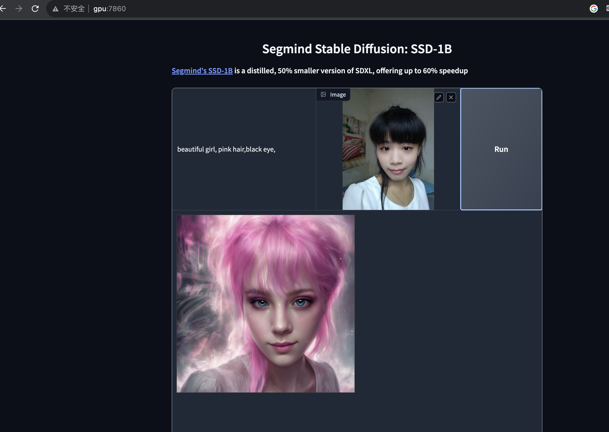

Check out the configuration reference at https://huggingface.co/docs/hub/spaces-config-reference

## Add controlnet support,fork form https://huggingface.co/spaces/segmind/Segmind-Stable-Diffusion/tree/main

